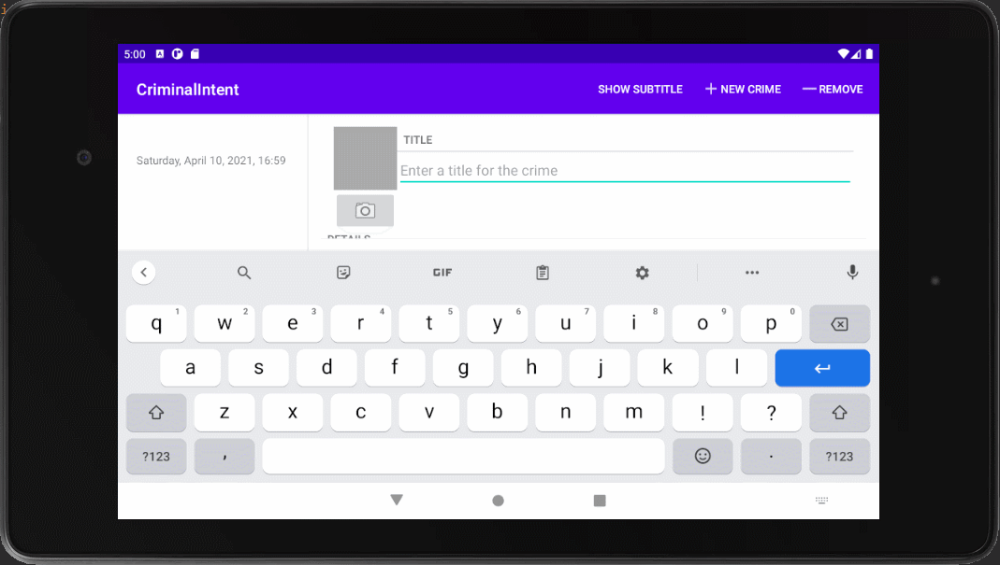

## :japanese_castle: CriminalIntent

_Стек: Android SDK/XML/SQLite_

Приложение, которое позволяет хранить различные офисные преступления, совершенные вашими коллегами :). Приложение делится на несколько частей - первая - список преступлений, в который можно добавить новое преступление и детализация преступления, через которую можно посмотреть кем и когда было совершено преступление, настроить его дату и время, сохранить фотографию и отчет по преступлению.

# Чему научился в ходе выполнения упражнения

Познакомился с объектами Fragment, SupportFragmentManadger, FileProvider, DialogFragment. Научился создавать неявные намерения (вызов камеры и получение фотографии, а также передача отчета другим приложением). Создал SQLite базу данных и написал к ней несколько запросов. 

# GIF

